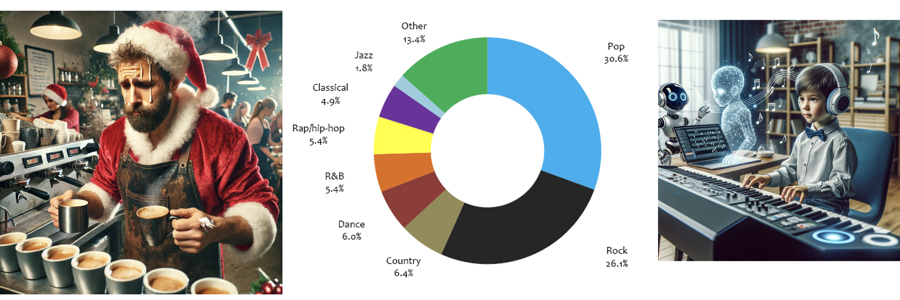
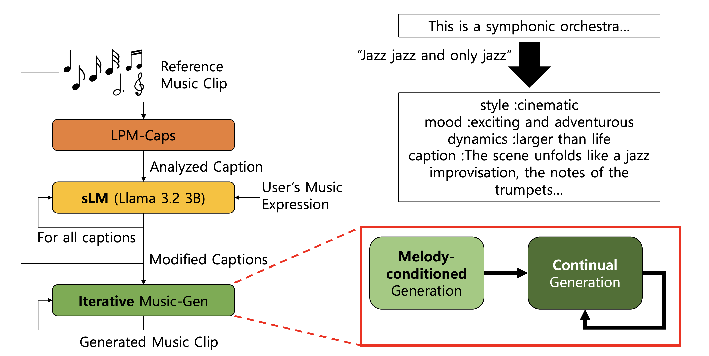

[m2t2m github](https://github.com/DongHyunnn/m2t2m)
# Mini Demo
[m2t2m github](https://github.com/DongHyunnn/m2t2m)

**Warning: The mini deom will work until 12/31**
# Motivation

Imagine you are managing a café during the Christmas season. The easiest way to create a festive mood is to play Christmas music. However, finding carol songs that perfectly match your café’s atmosphere can be challenging.

Similarly, if you are a fan of a niche music genre like jazz, which only makes up 1.8% of the music market (compared to Pop at 30.6% and Rock at 26.1%), it can be hard to find enough variety of songs in your preferred style.

For aspiring musicians who want to compose songs but lack musical knowledge, creating just one piece of music could take years of effort.

In all of these cases, generative AI can offer a solution. Existing text-to-music AI models, however, often fail to produce music that aligns with a user’s imagination.

To address this, we propose MTM (Music to Text to Music):
*   Our system generates new music based on an auto-captioned prompt from a given short music sample.
*   Users can modify the generated music further through custom instructions to achieve the desired output.

By combining user creativity with AI-assisted music generation, we aim to bring diverse, personalized, and accessible music creation to everyone.

This content retains the original intent while being more structured and suitable for a website’s Motivation section.

# Related Works
We used two existing music AI models, the lp-music caps from MAC LAB for auto-captioning, and the music gen from meta for music generation.
## LP-Music Caps
Our system, LPM-Caps, generates captions for music by analyzing short segments of 10 seconds each.

The model is trained using a two-step approach:
	1.	Pretraining on a large-scale pseudo-dataset generated by LLM-based models.
	2.	Transfer learning on a human-annotated music analysis dataset to refine accuracy and quality.

This combination allows LPM-Caps to produce detailed and meaningful descriptions of music clips.

For the demo, we put coffee house wav file into lp-music caps. As you can see, it generates prompts about it.
<video width="640" height="360" controls>
  <source src="img/lpcaps.mov" type="video/mp4">
  Your browser does not support the video tag.
</video>

## Music-gen

The Music Generation model used in this project is a result of Meta’s AudioCraft initiative. AudioCraft provides various models capable of generating music under multiple conditions:
*  Text-conditioned Generation: Generates music based on descriptive text prompts.
*  Music-conditioned Generation: Produces new music inspired by a given music sample.
*  Continual Generation: Generates seamless, continuous musical outputs.

Demo Example

In this project, we provided a Coffee House WAV file as a reference music input.
Additionally, we used the text prompt:
	“I need a new Carol song for this Christmas”
The model successfully generated a fitting carol track inspired by the given input.
<video width="640" height="360" controls>
  <source src="img/musicgen.mov" type="video/mp4">
  Your browser does not support the video tag.
</video>


# Our system

## Architecture


To overcome the limitations of existing models, we designed an Enhanced Music Generation System that integrates LPM-Caps, a Small Language Model (sLM), and the Music Generation Model.

Key Challenges Addressed
1.	Limited Range
	*	Simply concatenating models restricted the generated music to a limited range around the given sample.
2.	Caption Suitability
	*	The output of LPM-Caps was not optimally suitable for the Music Generation model.
3.	User Input Limitation
	*	User descriptions often lacked sufficient details to guide the music generation process effectively.

System Workflow

1.	Caption Generation (LPM-Caps)
	*	LPM-Caps generates captions by analyzing the input music clip and dividing it into 10-second segments.
2.	Caption Modification (sLM - Llama 3.2 3B)
	*	A Small Language Model (sLM) modifies the captions based on user-provided directions.
	*	sLM ensures the captions are detailed and aligned with the user’s intent, enhancing their compatibility with the Music Generation model.
3.	Music Generation
    The Music Generation model operates in two phases:
	*	Melody-Conditioned Generation
	    -	Edits the input reference clip to align with the modified captions.
	*	Continual Generation
	    -	Inspired by the auto-regressive mechanism of LLMs, the model iteratively generates the next clip based on the previously generated clip.
	    -	This ensures smooth transitions and allows for more variant and diverse music outputs.

## Demo

In this project, we developed a web-based demo using the Flask library and an HTML-based user interface. The system allows users to interact with our MTM (Music-to-Text-to-Music) pipeline locally.

How the Demo Works

1.	Caption Generation
	*  The demo starts with an input reference music sample (e.g., “Jingle Bells Carol”).
	*  By pushing the button, the LPM (Large Prompt Music) model generates captions for every 10 seconds of the music clip.
2.	User Customization
	*  The user can add their desired “taste” or modifications to the captions.
	*  To ensure the description is detailed and formatted properly, a Small Language Model (sLM) refines the user’s input to align with a   
      certain structure.
	*  The refined user expressions are then used consistently for all further model calls.
3.	Final Caption Generation
	*  The MTM system generates the final captions following the block segmentation created by the LPM model.
	*  These captions reflect the user’s customized input and provide descriptions for each segment of the music clip.
4.	Music Generation
	*  Using the generated captions and the initial music clips, the Music Generation model produces segment-by-segment music outputs.
	*  The individual clips are then concatenated into a complete music track.

UI Output

The server-based UI displays the following:
*  The Generated Captions: A clear reflection of the user’s customized input.

Limitations

While the system demonstrates the potential of generative music models, the output music quality is still limited and requires further improvement.

This demo highlights our system’s workflow and potential to generate customized music outputs through user interaction and refined textual prompts.
<video width="640" height="360" controls>
  <source src="img/demo.mp4" type="video/mp4">
  Your browser does not support the video tag.
</video>

## Code description

### main.py

The main.py script is the core component of our Music-to-Text-to-Music (MTM) System, implemented using Flask. It connects all the submodules (music captioning, small language model modification, and music generation) into a complete pipeline, accessible through a web-based UI.

Key Features

1.	Upload and Analyze Music
	*	Users can upload a .wav file as a reference music clip.
	*	The system uses a caption generation model (LPM-Caps) to analyze the music and generate captions for every 10-second segment.
```python
music_to_caption(music_file)
```
The above function runs a command-line call to generate music captions and stores the output.

2.	User Caption Modification
	*	Users can provide additional descriptions or modify captions to customize the music.
	*	A Small Language Model (sLM) (e.g., Llama 3.2 3B) refines these inputs and makes captions more vivid and detailed.
  * Takes the users input and combines it with existing captions.
	*	Ensures outputs follow a structured JSON format with musical attributes like style, mood, dynamics, and instruments.
```python
generate_new_caption(input_text)
```

3.	Music Generation Based on Captions
	*	The final captions and the reference music clip are passed into the Music Generation Model.
	*	The music generation runs in two steps:
	*	Melody-Conditioned Generation: Edits the input clip to align with the captions.
	*	Continual Generation: Generates new segments iteratively in an auto-regressive manner.
```python
generate_music_based_on_caption()
```
This function generates and saves the output music file based on the provided captions.

### caption.py
1. Audio Data Processing

	*	The input audio file is read and divided into segments of 10 seconds each.
	*	The audio is converted to:
	*	A specific sampling rate of 16kHz.
	*	A single-channel mono format for processing.

2. Model Loading and Inference

	*	The BartCaptionModel is loaded and executed on the GPU for high-performance inference.
	*	The model takes the processed audio data as input and generates corresponding text captions for each audio segment.

3. Output Generation

	*	For each audio segment, the model outputs the:
	*	Start and end times of the segment.
	*	Generated caption describing the content of the audio.
	*	The results are structured in a JSON format for easy interpretation and further use.

### music_gen.py

1. Input Audio Handling
	*	Input Audio:
	  *	The script reads an audio file (.wav format) and loads it using torchaudio.
	  *	The input audio acts as a melody for conditioning the first music segment.
	*	Captions:
	  *	A JSON-formatted string of captions is provided, where each caption describes a specific time segment of the music.

2. Melody-conditioned Generation (First Block)

	*	The MusicGen-melody model generates the first segment of music based on:
	  *	The input melody (audio waveform).
	  *	The first caption from the JSON input.
	*	The model produces an initial music segment of 10 seconds.
  ```python
  melody_output = melody_model.generate_with_chroma(
  descriptions=[first_caption],
  melody_wavs=melody_waveform,
  melody_sample_rate=sr,
  progress=True,) 
  ```
  This function takes the melody waveform and generates music conditioned on it

3. Continuation Generation (Subsequent Blocks)

	*	The MusicGen-small model generates subsequent music segments iteratively:
	  *	The last 5 seconds of the previous segment are used as a prompt.
	  *	The model generates the next 10-second clip using the corresponding caption.
	*	This ensures seamless continuation of music generation block-by-block.
   ```python
    continuation_output = continuation_model.generate_continuation(
    prompt=combined_waveform[..., -last_n_samples:],
    prompt_sample_rate=sr,
    descriptions=[caption],
    progress=True,)
  ```
  The function accepts the last portion of the waveform and generates the next clip.

4. Audio Saving
	*  Each generated music block is saved as an individual .wav file (e.g., block1.wav, block2.wav).
	*  All blocks are concatenated into a final output file (e.g., generated.wav) and saved to the specified directory.


### text_prompting.py

This script uses Meta’s LLaMA-2 or LLaMA-3.2 models to generate refined or modified captions for music based on user input (e.g., specific instructions like “happy” or “energetic”). It takes a previous caption and an instruction to produce a structured JSON output containing the updated caption details.

Key features
1. Input Parsing

	*  System Instruction: General guidelines for the model (e.g., “Reflect the instruction to caption. Answer only with the modified caption.”).
	*  Previous Captions:
	  * Descriptive text input of musical segments, time-coded for precision.
    *	Captions are passed as a long string containing multiple {text, time} dictionaries.
	* User Instruction: A simple modification or mood input (e.g., “happy”).

2. Model Loading

	*  The script uses Meta’s LLaMA-3.2-3B-Instruct model from HuggingFace.
	*  The model and tokenizer are loaded efficiently with:
	  * torch_dtype=torch.float16 for performance optimization.
	  *	Automatic GPU mapping using device_map="auto".
  ```python 
  model = AutoModelForCausalLM.from_pretrained(
  model_name,
  torch_dtype=dtype,
  device_map="auto",
  trust_remote_code=True)
  tokenizer = AutoTokenizer.from_pretrained(model_name, use_fast=True)
  ```

3. Text Generation

	*  The model generates text based on a constructed prompt combining:
	  *  The system instruction.
	  * Previous captions.
	  * User-provided musical expression (instructions).
	*	The generation process uses:
	  *  max_length: Controls the total generation length.
	  *  temperature: Adjusts output creativity (higher value = more randomness).
    *  top_p: Nucleus sampling for filtering likely outputs.
  ```python 
  outputs = model.generate(
  inputs.input_ids,
  max_length=max_length,
  temperature=temperature,
  top_p=top_p,
  do_sample=True,
  pad_token_id=tokenizer.pad_token_id)
  ```


# Challenges &  Future works

## Challenges
  *  Limited LLM model size of local server(3080Ti)
  *  Hard to predict LLM output

## Future wokrs
  *  Prompt engineering
  *  Too short given clip for concatenative generations…?
  
  
  

